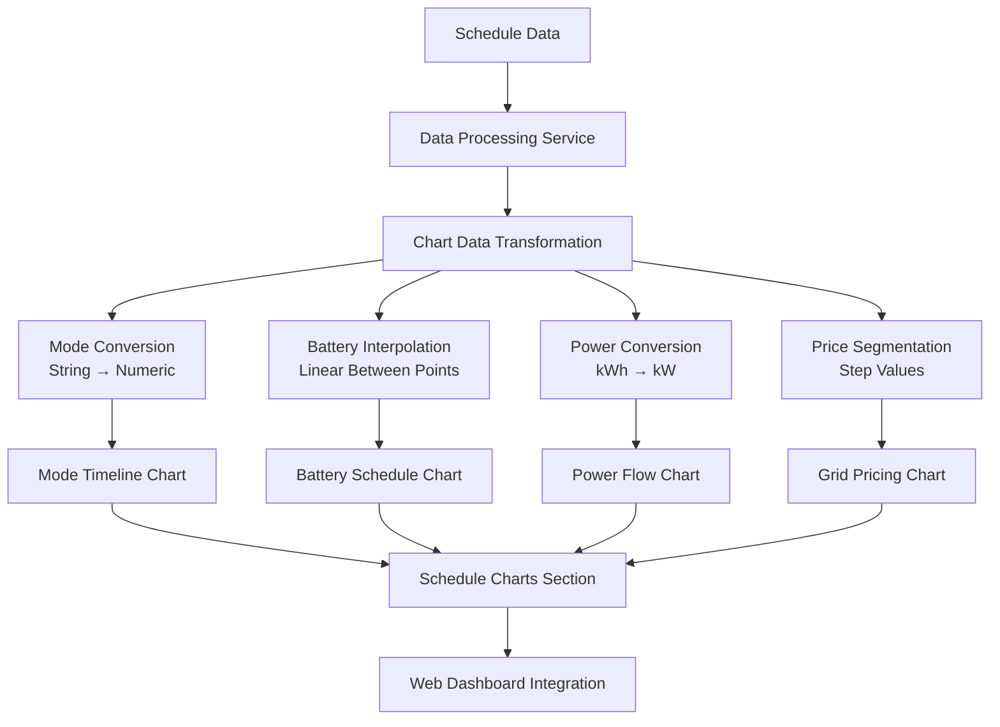
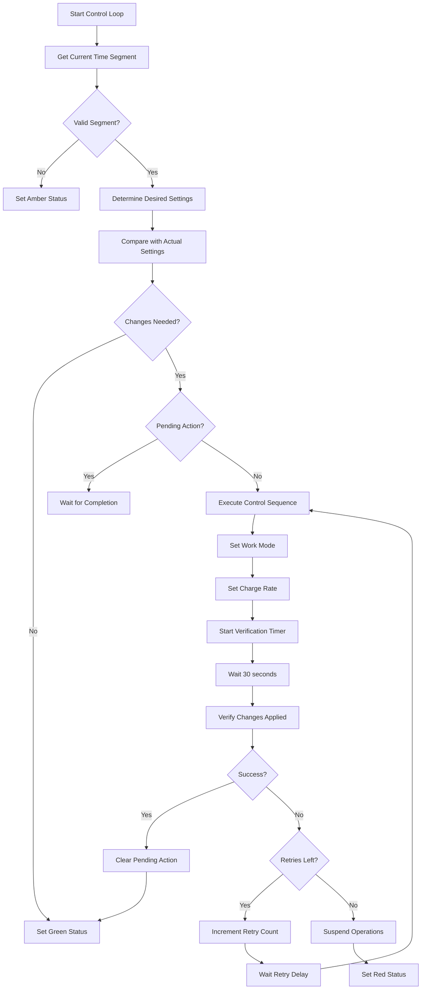

# Solar Inverter Control System

A comprehensive TypeScript/Deno application for automated solar inverter control, monitoring, and optimization. The system intelligently manages battery charging/discharging cycles based on scheduled time segments, grid pricing, and solar generation patterns.

## Overview

This system provides:
- **Automated Inverter Control**: Intelligent switching between charging and discharging modes
- **Schedule-Based Operation**: Time-segmented control based on energy pricing and consumption patterns
- **Real-time Monitoring**: Web-based dashboard with live metrics and historical data
- **MQTT Integration**: Seamless communication with Solar Assistant and inverter systems
- **Fault Tolerance**: Automatic retry mechanisms and error handling
- **Cost Optimization**: Grid usage minimization during peak pricing periods

## Architecture

### System Components

```
┌─────────────────┐    ┌──────────────────┐    ┌─────────────────┐
│   Web Client    │◄──►│  HTTP/WebSocket  │◄──►│  Main App       │
│  (Dashboard)    │    │    Server        │    │  (main.ts)      │
└─────────────────┘    └──────────────────┘    └─────────────────┘
                                                        │
                       ┌─────────────────────────────────┼─────────────────────────────────┐
                       │                                 │                                 │
              ┌────────▼────────┐              ┌────────▼────────┐              ┌────────▼────────┐
              │ Inverter        │              │ Schedule        │              │ Database        │
              │ Controller      │              │ Service         │              │ Service         │
              │                 │              │                 │              │                 │
              │ • Control Logic │              │ • Time Segments │              │ • Metrics       │
              │ • State Machine │              │ • Mode Planning │              │ • Actions       │
              │ • Retry Logic   │              │ • Cost Calc     │              │ • Status        │
              └────────┬────────┘              └─────────────────┘              └─────────────────┘
                       │
              ┌────────▼────────┐
              │ MQTT Service    │
              │                 │
              │ • Pub/Sub       │
              │ • Topics        │
              │ • Reconnection  │
              └────────┬────────┘
                       │
              ┌────────▼────────┐
              │ Solar Assistant │
              │ & Inverter      │
              │ Hardware        │
              └─────────────────┘
```

### Data Flow

1. **Schedule Loading**: `ScheduleService` loads time-segmented control plans from `schedules/schedule.json`
2. **MQTT Communication**: `MqttService` establishes connection to Solar Assistant broker
3. **Real-time Monitoring**: System continuously receives inverter metrics via MQTT
4. **Control Logic**: `InverterController` determines required actions based on current time segment
5. **Command Execution**: System publishes control commands (work mode, charge rate) via MQTT
6. **Verification**: Actions are verified and retried if necessary
7. **Data Storage**: All metrics and actions are stored in SQLite database
8. **Web Interface**: Real-time dashboard provides monitoring and manual controls

## File Structure

```
├── main.ts                     # Application entry point and HTTP server
├── config.json                 # System configuration
├── deno.json                   # Deno project configuration
│
├── src/
│   ├── services/
│   │   ├── config.ts          # Configuration management
│   │   ├── mqtt.ts            # MQTT communication layer
│   │   ├── schedule.ts        # Time segment and schedule management
│   │   ├── inverter-controller.ts  # Core control logic and state machine
│   │   ├── database.ts        # SQLite data persistence
│   │   └── websocket.ts       # Real-time web communication
│   │
│   └── types/
│       ├── config.ts          # Configuration type definitions
│       └── schedule.ts        # Schedule and metric type definitions
│
├── public/                    # Web dashboard files
│   ├── index.html            # Main dashboard interface
│   ├── app.js                # Client-side JavaScript
│   └── styles.css            # Dashboard styling
│
├── schedules/
│   └── schedule.json         # Time-segmented control schedule
│
└── data/                     # SQLite database and logs
    └── solar_system.db       # Metrics and control action storage
```

## Core Services

### InverterController (`src/services/inverter-controller.ts`)

The heart of the system, managing:
- **State Machine**: Tracks system status (green/amber/red)
- **Control Loop**: 30-second cycle checking for required actions
- **Mode Management**: Switches between "Battery first" and "Load first" modes
- **Charge Rate Control**: Sets battery charging rates (0-100%)
- **Verification System**: Confirms commands were executed successfully
- **Retry Logic**: Automatic retry with exponential backoff
- **Error Handling**: Suspend operations when max retries exceeded

### ScheduleService (`src/services/schedule.ts`)

Manages time-based control scheduling:
- **Time Segments**: 30-minute blocks with specific control modes
- **Mode Types**:
  - `ChargeFromGridAndSolar`: Full charging from all sources
  - `ChargeSolarOnly`: Solar-only charging
  - `Discharge`: Battery discharge to loads
- **Current Segment Detection**: Finds active time segment based on current time
- **Schedule Validation**: Ensures schedule integrity and proper mode definitions

### MqttService (`src/services/mqtt.ts`)

Handles all MQTT communication:

**Subscribed Topics** (State Monitoring):
```
solar_assistant/inverter_1/battery_first_charge_rate/state
solar_assistant/inverter_1/work_mode_priority/state
solar_assistant/inverter_1/load_power/state
solar_assistant/inverter_1/grid_power/state
solar_assistant/battery_1/power/state
solar_assistant/battery_1/current/state
solar_assistant/battery_1/charge/state
solar_assistant/set/response_message/state
```

**Published Topics** (Control Commands):
```
solar_assistant/inverter_1/battery_first_charge_rate/set
solar_assistant/inverter_1/work_mode_priority/set
```

### DatabaseService (`src/services/database.ts`)

SQLite-based data persistence:
- **Metrics Table**: Real-time inverter measurements
- **Control Actions Table**: Command history and success/failure tracking
- **System Status Table**: State changes and error conditions
- **Indexed Queries**: Optimized time-based data retrieval

### WebSocketService (`src/services/websocket.ts`)

Real-time web communication:
- **Live Updates**: 10-second broadcast cycle
- **Initial Data**: Complete system state on connection
- **Interactive Controls**: Manual retry and system commands
- **Event Broadcasting**: Real-time log messages and state changes

## Configuration

### Main Config (`config.json`)

```json
{
  "mqtt": {
    "host": "192.168.1.181",
    "port": 1883,
    "clientId": "solar_inverter_controller"
  },
  "smtp": {
    "host": "smtp.gmail.com",
    "port": 587,
    "secure": false,
    "username": "your-email@gmail.com",
    "password": "your-app-password",
    "from": "your-email@gmail.com",
    "to": "your-email@gmail.com"
  },
  "schedulePath": "schedules/schedule.json",
  "dbPath": "data/solar_system.db",
  "retryAttempts": 3,
  "retryDelayMinutes": 5,
  "webPort": 8080,
  "logLevel": "INFO"
}
```

### Schedule Configuration (`schedules/schedule.json`)

Time-segmented control plan with 30-minute blocks:

```json
[
  {
    "time": {
      "segmentStart": "01:00:00",
      "segmentEnd": "01:30:00" 
    },
    "mode": "ChargeFromGridAndSolar",
    "expectedSolarGeneration": 0.0,
    "expectedConsumption": 0.69535685,
    "actualGridUsage": 3.6953568,
    "gridPrice": 0.049245,
    "startBatteryChargeKwh": 0.0,
    "endBatteryChargeKwh": 3.0,
    "wastedSolarGeneration": 0.0,
    "cost": {
      "poundsAmount": 0.181977855465
    }
  }
]
```

## Installation & Setup

### Prerequisites

- [Deno](https://deno.land/) 1.40+ installed
- Solar Assistant running with MQTT broker
- Compatible solar inverter system

### Installation

1. Clone the repository:
```bash
git clone <repository-url>
cd solar-inverter-control
```

2. Configure the system:
```bash
# Edit config.json with your MQTT broker details
cp config.json.example config.json
nano config.json

# Create data directory
mkdir -p data

# Place your schedule file
cp schedules/schedule.example.json schedules/schedule.json
```

3. Run the application:
```bash
# Development mode (with auto-reload)
deno task dev

# Production mode
deno task start
```

4. Access the dashboard:
```
http://localhost:8080
```

## Usage

### Web Dashboard Features

The dashboard provides comprehensive monitoring and control:

**Status Overview**:
- System status indicator (Green/Amber/Red)
- Current and desired inverter settings
- Next scheduled mode change
- Manual retry controls

**Real-time Metrics**:
- Load Power (kW)
- Grid Power (kW) 
- Battery Power (kW)
- Battery Current (A)

**Historical Charts**:
- Real-time power flow visualization
- Expected vs actual battery levels
- Cost analysis and grid usage
- Control action history

**System Log**:
- Real-time event logging
- Error tracking and diagnostics
- Control action confirmations
### Schedule Charts

The dashboard includes comprehensive 24-hour schedule visualization charts that provide detailed insights into planned system operation, energy flows, and cost optimization strategies.

#### Mode Timeline Chart

**Purpose**: Visualizes the operating mode transitions throughout the complete 24-hour schedule.

**Data Processing**:
- Converts schedule modes to numeric values for line chart rendering:
  - [`ChargeFromGridAndSolar`](src/types/schedule.ts:2) → 1 (Grid + Solar charging)
  - [`ChargeSolarOnly`](src/types/schedule.ts:3) → 2 (Solar-only charging)  
  - [`Discharge`](src/types/schedule.ts:4) → 3 (Battery discharge mode)

**Chart Specifications**:
- **Type**: Step-line chart with mode transition markers
- **X-Axis**: Time (00:00 - 23:59, 30-minute segments)
- **Y-Axis**: Mode value (1-3) with custom labels
- **Colors**: Distinct colors for each operational mode
- **Tooltips**: Display actual mode names and time ranges

#### Battery Charge Schedule Chart

**Purpose**: Shows planned battery charge levels with smooth interpolation between time segments.

**Data Processing**:
- Uses [`startBatteryChargeKwh`](schedules/schedule.json:12) and [`endBatteryChargeKwh`](schedules/schedule.json:13) from schedule segments
- Applies linear interpolation between segment boundaries for smooth visualization
- Displays charge progression in kWh units

**Chart Specifications**:
- **Type**: Smooth line chart with area fill
- **X-Axis**: Time (24-hour timeline)
- **Y-Axis**: Battery charge (kWh, 0-10 kWh range)
- **Interpolation**: Linear between segment start/end values
- **Visual**: Area under curve with gradient fill

#### Grid Pricing Chart

**Purpose**: Displays electricity pricing per time segment without interpolation to show exact pricing periods.

**Data Processing**:
- Uses [`gridPrice`](schedules/schedule.json:11) values directly from schedule segments
- No interpolation applied - shows step changes at segment boundaries
- Displays pricing in pence per kWh

**Chart Specifications**:
- **Type**: Step chart (no interpolation between segments)
- **X-Axis**: Time (24-hour timeline)
- **Y-Axis**: Price (pence per kWh)
- **Colors**: Heat map gradient (red=expensive, green=cheap)
- **Annotations**: Peak/off-peak period markers

#### Power Flow Comparison Chart

**Purpose**: Compares expected load, grid usage, and solar generation on a single chart for comprehensive energy flow analysis.

**Data Processing**:
- Converts kWh values to kW by dividing by 0.5 (30-minute segment duration)
- Three data series:
  - **Expected Load**: [`expectedConsumption`](schedules/schedule.json:9) converted to kW
  - **Expected Grid Usage**: [`actualGridUsage`](schedules/schedule.json:10) converted to kW
  - **Expected Solar**: [`expectedSolarGeneration`](schedules/schedule.json:8) converted to kW

**Chart Specifications**:
- **Type**: Multi-line chart with distinct line styles
- **X-Axis**: Time (24-hour timeline)
- **Y-Axis**: Power (kW)
- **Lines**: 
  - Load (blue, solid line)
  - Grid (red, dashed line)
  - Solar (yellow, dotted line)
- **Legend**: Clear identification with power source icons

#### Implementation Architecture



#### Chart Integration Features

**Interactive Elements**:
- **Synchronized Time Selection**: Linked time range selection across all schedule charts
- **Detailed Tooltips**: Hover information showing exact values and time ranges
- **Chart Zoom**: Focus on specific time periods for detailed analysis
- **Export Functionality**: Download charts as PNG/SVG for reporting

**Data Updates**:
- **Real-time Sync**: Charts update automatically when [`schedule.json`](schedules/schedule.json:1) changes
- **WebSocket Integration**: Live updates via [`WebSocketService`](src/services/websocket.ts:149)
- **Caching Strategy**: Client-side schedule data caching for performance

**Responsive Design**:
- **Mobile Optimization**: Touch-friendly chart interactions
- **Adaptive Layout**: Charts resize based on screen dimensions
- **Performance**: Optimized rendering for 48 time segments (24 hours × 30-minute intervals)

#### Technical Implementation

**Frontend Components** ([`app.js`](public/app.js:2)):
```javascript
// Schedule chart initialization
initializeScheduleCharts() {
    this.initializeModeTimelineChart();
    this.initializeBatteryScheduleChart(); 
    this.initializeGridPricingChart();
    this.initializePowerFlowChart();
}

// Mode conversion utility
convertModeToNumeric(mode) {
    const modeMap = {
        'ChargeFromGridAndSolar': 1,
        'ChargeSolarOnly': 2,
        'Discharge': 3
    };
    return modeMap[mode] || 0;
}

// Power unit conversion
convertKwhToKw(kwhValue) {
    return kwhValue / 0.5; // 30-minute segments
}
```

**API Integration**:
- **Schedule Endpoint**: [`GET /api/schedule`](main.ts:65) returns chart-optimized schedule data
- **Chart Data Processing**: Server-side preprocessing for optimal chart performance
- **Update Notifications**: WebSocket broadcasts for schedule changes

### Control Modes

**Battery First Mode** (`work_mode_priority: "Battery first"`):
- Battery supplies loads preferentially
- Grid used only when battery insufficient
- Used during discharge periods and solar-only charging

**Load First Mode** (`work_mode_priority: "Load first"`):
- Grid/solar supplies loads directly
- Excess power charges battery
- Used during grid+solar charging periods

### Charge Rate Control

- **0%**: No grid charging (solar-only or discharge modes)
- **100%**: Maximum grid charging rate (grid+solar charging mode)
- Automatically adjusted based on current time segment

## Control Logic Flow



## Error Handling & Recovery

### Automatic Retry System

1. **Initial Failure**: Control action verification fails
2. **Retry Logic**: Up to 3 attempts with 5-minute delays
3. **Exponential Backoff**: Increasing delays between retries
4. **Suspension**: Operations suspended after max retries
5. **Manual Recovery**: Web dashboard retry button

### System States

- **Green**: Normal operation, all systems functioning
- **Amber**: Transitioning states, updates in progress
- **Red**: Operations suspended, manual intervention required

### Fault Tolerance

- **MQTT Reconnection**: Automatic reconnection with exponential backoff
- **Database Integrity**: Transaction-based updates with rollback capability
- **Schedule Validation**: Comprehensive validation prevents invalid configurations
- **State Persistence**: System state maintained across restarts

## Monitoring & Diagnostics

### Real-time Monitoring

- **WebSocket Updates**: 10-second live data broadcasts
- **System Status**: Continuous health monitoring
- **Performance Metrics**: Response times and success rates

### Data Storage

- **Metrics Retention**: 24+ hours of detailed measurements
- **Action History**: Complete control action audit trail
- **Status History**: System state changes and error conditions

### Logging

- **Structured Logging**: Timestamped events with severity levels
- **Web Dashboard**: Real-time log display with filtering
- **Persistent Storage**: Database-backed log retention

## API Endpoints

### REST API

```bash
# Get current system status
GET /api/status

# Get recent metrics (default: 24 hours)
GET /api/metrics?hours=24

# Get control action history
GET /api/control-actions?hours=24

# Get current schedule
GET /api/schedule

# Manual retry operations
POST /api/retry
```

### WebSocket API

Real-time communication for:
- Live system updates
- Control action responses
- Log message streaming
- Interactive dashboard features

## Development

### Project Structure

- **TypeScript**: Strongly typed codebase
- **Deno Runtime**: Modern JavaScript/TypeScript runtime
- **Modular Services**: Separation of concerns architecture
- **SQLite Database**: Embedded, file-based data storage

### Key Dependencies

```json
{
  "@std/http": "HTTP server functionality",
  "@std/path": "Path manipulation utilities", 
  "@std/fs": "File system operations",
  "@std/log": "Structured logging",
  "sqlite": "SQLite database driver",
  "mqtt": "MQTT client library"
}
```

### Testing

```bash
# Run tests
deno task test

# Type checking
deno check main.ts
```

## Security Considerations

- **MQTT Authentication**: Optional username/password authentication
- **Web Interface**: Local network access recommended
- **Configuration**: Sensitive credentials in config file
- **Database**: File-based storage with appropriate permissions

## Troubleshooting

### Common Issues

**MQTT Connection Failures**:
- Verify broker address and port in `config.json`
- Check network connectivity to Solar Assistant
- Review MQTT credentials if authentication enabled

**Schedule Not Loading**:
- Validate JSON syntax in `schedules/schedule.json`
- Ensure all required fields present in time segments
- Check file permissions and path accessibility

**Control Actions Failing**:
- Verify MQTT topics match your Solar Assistant configuration
- Check inverter compatibility and response times
- Review system logs for detailed error messages

### Debug Mode

Enable verbose logging:
```json
{
  "logLevel": "DEBUG"
}
```

## Contributing

1. Fork the repository
2. Create feature branch (`git checkout -b feature/amazing-feature`)
3. Commit changes (`git commit -m 'Add amazing feature'`)
4. Push to branch (`git push origin feature/amazing-feature`)
5. Open Pull Request

## License

This project is licensed under the MIT License - see the LICENSE file for details.

## Acknowledgments

- Solar Assistant for MQTT integration capabilities
- Deno team for the excellent runtime environment
- Chart.js for dashboard visualization components
