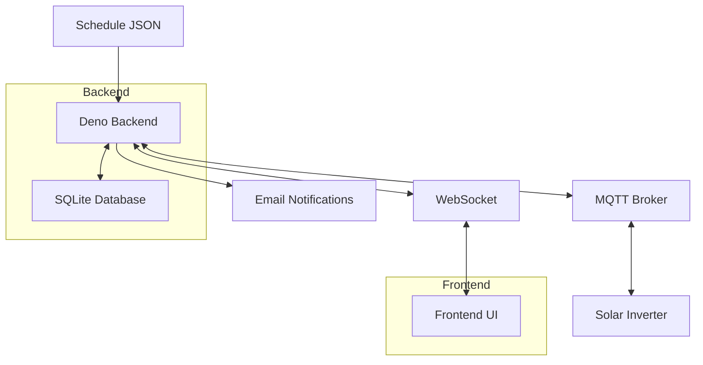
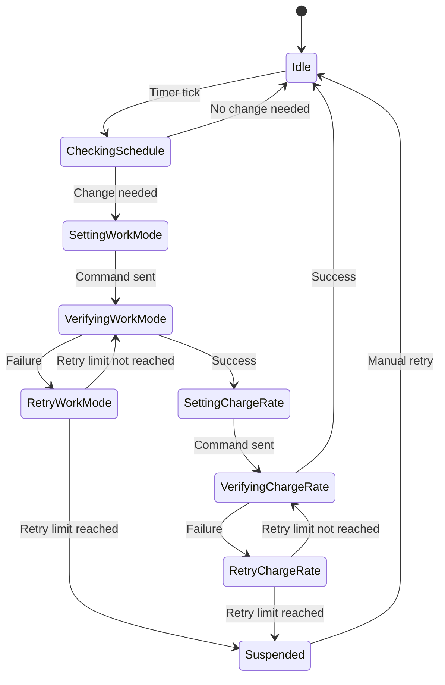

# Solar Inverter Control System - Implementation Plan

## 1. System Architecture



## 2. Component Breakdown

### 2.1 Configuration Management
- Create a configuration interface for MQTT, SMTP, and application settings
- Implement configuration loading from a JSON file
- Support both authenticated and non-authenticated MQTT connections

### 2.2 Schedule Management
- Implement schedule loading from JSON file
- Create data models matching the TimeSegment structure
- Develop logic to determine the current time segment based on system time

### 2.3 MQTT Communication
- Implement MQTT client for Deno
- Set up subscription to required topics:
  - `solar_assistant/inverter_1/battery_first_charge_rate/state`
  - `solar_assistant/inverter_1/work_mode_priority/state`
  - `solar_assistant/inverter_1/load_power/state`
  - `solar_assistant/inverter_1/grid_power/state`
  - `solar_assistant/battery_1/power/state`
  - `solar_assistant/battery_1/current/state`
  - `solar_assistant/set/response_message/state`
- Implement publishing to control topics:
  - `solar_assistant/inverter_1/battery_first_charge_rate/set`
  - `solar_assistant/inverter_1/work_mode_priority/set`

### 2.4 Inverter Control Logic
- Implement state machine for inverter control
- Handle the sequencing requirement (set work mode before charge rate)
- Implement retry logic with failure detection
- Create suspension mechanism with email notifications

### 2.5 Data Persistence
- Set up SQLite database schema for storing:
  - Historical metrics
  - System state history
  - Control actions and their results
- Implement data access layer

### 2.6 WebSocket Server
- Implement WebSocket server for real-time communication with frontend
- Create message protocol for different data types
- Set up event broadcasting for state changes

### 2.7 Frontend UI
- Create responsive layout with Material CSS
- Implement status indicator (green/amber/red)
- Create charts for:
  - Current metrics (load, grid, battery power)
  - Expected vs. actual values for controlled parameters
  - Predicted vs. actual values for solar generation, load, and grid usage
  - Cost calculation based on grid usage and prices
- Implement on-screen log display
- Add retry button for suspended state

## 3. Implementation Phases

### Phase 1: Project Setup and Core Infrastructure
1. Initialize Deno project with TypeScript
2. Set up project structure
3. Implement configuration management
4. Create basic data models
5. Set up SQLite database

### Phase 2: MQTT and Control Logic
1. Implement MQTT client
2. Develop schedule parsing and time segment determination
3. Create inverter control state machine
4. Implement retry and suspension logic
5. Set up email notification system

### Phase 3: Data Collection and Storage
1. Implement metric collection from MQTT
2. Develop data persistence layer
3. Create historical data queries
4. Implement cost calculation logic

### Phase 4: WebSocket and Frontend
1. Develop WebSocket server
2. Create basic HTML/CSS structure
3. Implement status indicators and controls
4. Set up charting with a library (Chart.js)
5. Create on-screen logging display

### Phase 5: Testing and Refinement
1. Implement comprehensive logging
2. Test failure scenarios
3. Optimize performance
4. Add any missing features
5. Final polish and documentation

## 4. Technical Stack

### Backend
- **Runtime**: Deno
- **Language**: TypeScript
- **Database**: SQLite
- **MQTT Client**: MQTT.js or similar Deno-compatible library
- **Email**: SMTP client for Deno
- **WebSocket**: Native Deno WebSocket implementation

### Frontend
- **HTML/CSS/JS**: Vanilla implementation
- **CSS Framework**: Material Design Lite or similar (via CDN)
- **Charting**: Chart.js (via CDN)
- **WebSocket**: Native browser WebSocket API

## 5. Data Models

### Configuration
```typescript
interface MqttConfig {
  host: string;
  port: number;
  username?: string;
  password?: string;
  clientId: string;
}

interface SmtpConfig {
  host: string;
  port: number;
  secure: boolean;
  username?: string;
  password?: string;
  from: string;
  to: string;
}

interface AppConfig {
  mqtt: MqttConfig;
  smtp: SmtpConfig;
  schedulePath: string;
  dbPath: string;
  retryAttempts: number;
  retryDelayMinutes: number;
}
```

### Schedule Data
```typescript
enum OutputsMode {
  ChargeFromGridAndSolar = "ChargeFromGridAndSolar",
  ChargeSolarOnly = "ChargeSolarOnly",
  Discharge = "Discharge"
}

interface HalfHourSegment {
  hourStart: string;
  hourEnd: string;
}

interface TimeSegment {
  halfHourSegment: HalfHourSegment;
  expectedSolarGeneration: number;
  gridPrice: number;
  expectedConsumption: number;
  startBatteryChargeKwh: number;
  endBatteryChargeKwh: number;
  mode: OutputsMode;
  wastedSolarGeneration: number;
  actualGridUsage: number;
}
```

### System State
```typescript
interface SystemState {
  timestamp: number;
  batteryChargeRate: number;
  workModePriority: string;
  loadPower: number;
  gridPower: number;
  batteryPower: number;
  batteryCurrent: number;
  desiredChargeRate: number;
  desiredWorkMode: string;
  status: "green" | "amber" | "red";
  currentSegment?: TimeSegment;
}
```

## 6. Database Schema

```sql
CREATE TABLE metrics (
  id INTEGER PRIMARY KEY AUTOINCREMENT,
  timestamp INTEGER NOT NULL,
  battery_charge_rate REAL,
  work_mode_priority TEXT,
  load_power REAL,
  grid_power REAL,
  battery_power REAL,
  battery_current REAL
);

CREATE TABLE control_actions (
  id INTEGER PRIMARY KEY AUTOINCREMENT,
  timestamp INTEGER NOT NULL,
  action_type TEXT NOT NULL,
  target_value TEXT NOT NULL,
  success BOOLEAN,
  response_message TEXT,
  retry_count INTEGER DEFAULT 0
);

CREATE TABLE system_status (
  id INTEGER PRIMARY KEY AUTOINCREMENT,
  timestamp INTEGER NOT NULL,
  status TEXT NOT NULL,
  message TEXT
);
```

## 7. Key Algorithms

### Current Time Segment Determination
```typescript
function getCurrentTimeSegment(schedule: TimeSegment[]): TimeSegment | null {
  const now = new Date();
  const currentHour = now.getHours();
  const currentMinute = now.getMinutes();
  
  return schedule.find(segment => {
    const startParts = segment.halfHourSegment.hourStart.split(':');
    const endParts = segment.halfHourSegment.hourEnd.split(':');
    
    const startHour = parseInt(startParts[0]);
    const startMinute = parseInt(startParts[1]);
    const endHour = parseInt(endParts[0]);
    const endMinute = parseInt(endParts[1]);
    
    const startTime = startHour * 60 + startMinute;
    const endTime = endHour * 60 + endMinute;
    const currentTime = currentHour * 60 + currentMinute;
    
    return currentTime >= startTime && currentTime < endTime;
  }) || null;
}
```

### Inverter Control State Machine


## 8. UI Mockup

```
+--------------------------------------------------------------+
|                 Solar Inverter Control System                 |
+--------------------------------------------------------------+
| Status: [GREEN] System operating normally                     |
+--------------------------------------------------------------+
| Current Settings:                                             |
| - Work Mode: Battery First                                    |
| - Charge Rate: 0%                                             |
+--------------------------------------------------------------+
|                                                              |
| [Chart: Current Metrics]                                     |
| - Load Power                                                 |
| - Grid Power                                                 |
| - Battery Power                                              |
|                                                              |
+--------------------------------------------------------------+
|                                                              |
| [Chart: Expected vs Actual Control Parameters]               |
| - Work Mode                                                  |
| - Charge Rate                                                |
|                                                              |
+--------------------------------------------------------------+
|                                                              |
| [Chart: Predicted vs Actual Values]                          |
| - Solar Generation                                           |
| - Load                                                       |
| - Grid Usage                                                 |
|                                                              |
+--------------------------------------------------------------+
| Total Grid Cost: £XX.XX                                      |
+--------------------------------------------------------------+
| System Log:                                                  |
| [12:34:56] Setting work mode to Battery First                |
| [12:34:57] Response: Success                                 |
| [12:34:58] Setting charge rate to 0%                         |
| [12:34:59] Response: Success                                 |
+--------------------------------------------------------------+
```

## 9. Extensibility Considerations

1. **Metric Plugin System**
   - Create a plugin architecture for adding new metrics
   - Define a standard interface for metric collectors
   - Allow dynamic registration of new metrics

2. **Chart Configuration**
   - Make chart configurations customizable
   - Allow adding new charts without code changes

3. **Control Actions**
   - Design a generic action framework that can be extended
   - Support for additional inverter commands

4. **Alerting System**
   - Extend beyond email to support other notification methods
   - Allow configurable alert conditions

## 10. Fault Tolerance Mechanisms

1. **Connection Recovery**
   - Automatic reconnection to MQTT broker
   - Backoff strategy for reconnection attempts

2. **Data Buffering**
   - Local buffering of metrics during connection loss
   - Batch updates to database when connection is restored

3. **State Recovery**
   - Persistence of control system state
   - Recovery to last known good state after restart

4. **Error Handling**
   - Comprehensive error logging
   - Graceful degradation of features

5. **Watchdog**
   - Internal watchdog to detect and recover from hangs
   - Periodic health checks